# Toolbox Architecture

## 1. System Overview

### 1.1 Ownership Hierarchy

```
CShwApp (global)
├─ CProject (current project)
│  ├─ CDatabaseTypeSet
│  │  └─ CDatabaseType[1..n]
│  │     ├─ CMarkerSet
│  │     ├─ CFilterSet
│  │     ├─ CJumpPathSet
│  │     └─ CInterlinearProcList
│  │        └─ CLookupProc[1..n]
│  ├─ CLangEncSet
│  └─ CCorpusSet
├─ CMainFrame (main window)
│  └─ CShwView[1..n] (open windows)
│     └─ CShwDoc (reference, not owned)
└─ CShwDoc[1..n] (open database files)
   └─ CIndexSet
      └─ CIndex[1..n]
         └─ CRecord[1..n]
            └─ CField[1..n]

References (not ownership):

CField  → CMarker (via CMString)
CIndex  → CMarker (sort key), CFilter
CShwView → CShwDoc (displays)
CRecPos → CRecord, CField (navigation cursor)
```

### 1.2 Ownership Graph

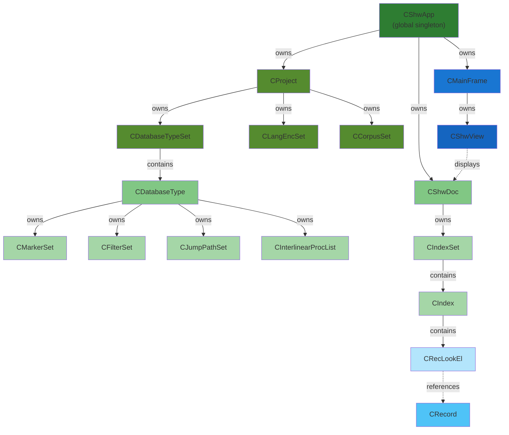

### 1.3 Project Structure Graph

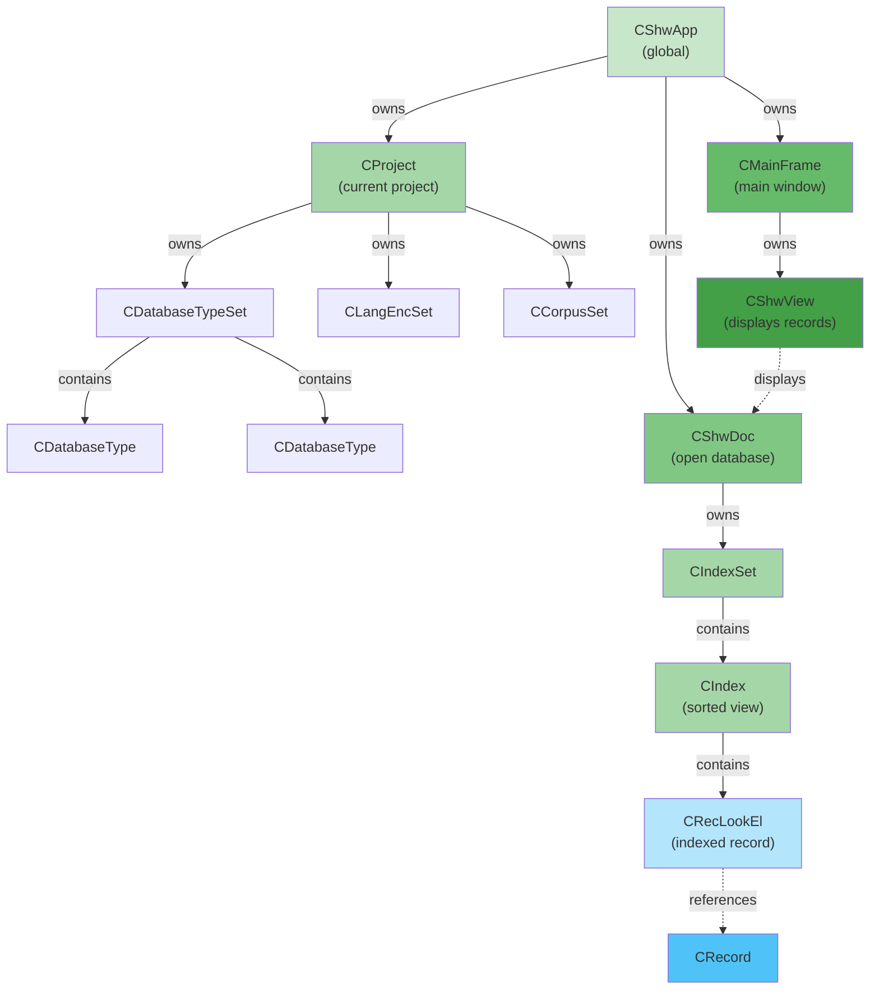

---

## 2. High-Level Summary

1. **Application Layer** (`CShwApp` → `CMainFrame` → `CShwView`): UI and global state
2. **Project Layer** (`CProject`): All settings, schemas, and corpuses for a project
3. **Document Layer** (`CShwDoc`): One open database file and its indexes
4. **Processing Layer** (`CInterlinearProcList` → `CLookupProc`): How data is analyzed and transformed
5. **Indexing Layer** (`CIndex` → `CIndexSet`): How records are sorted and searched
6. **Organization Layer** (`CFieldList` → `CMarkerSet` → `CDatabaseType`): How fields are organized and what they mean
7. **Bottom Layer** (`Str8` → `CMString` → `CField` → `CRecord`): Raw text representation and storage

**Key Insight**: A `CRecord` is the atomic unit—it contains all fields for one entry. Fields are marked with `CMarker` to give them meaning. Multiple `CIndex` views sort the same records differently. `CShwDoc` holds the file; `CProject` holds the schema. `CShwView` displays it to the user.

---

## 3. Visual Data Flow

```
CShwApp (global application)
└─ CProject (current project settings)
   └─ CDatabaseTypeSet
      └─ CDatabaseType "Dictionary"
         ├─ CMarkerSet
         │   ├─ CMarker "tx" (text field)
         │   ├─ CMarker "ps" (part of speech)
         │   └─ CMarker "dt" (definition)
         ├─ CInterlinearProcList
         │   └─ CLookupProc (morpheme parser)
         │       └─ CDbTrie (lexicon)
         │           ├─ Entry: "jump" → gloss
         │           └─ Entry: "-ed" → gloss
         └─ CIndexSet
            └─ CIndex (sorted by headword)
               └─ CRecLookEl[1]
                  └─ CRecord (one dictionary entry)
                     ├─ CField[1]: marker="tx", content="jumped"
                     │   └─ CMString
                     │       ├─ Str8: "jumped"
                     │       └─ CMarker: "tx"
                     ├─ CField[2]: marker="ps", content="verb"
                     │   └─ CMString
                     │       ├─ Str8: "verb"
                     │       └─ CMarker: "ps"
                     └─ CField[3]: marker="dt", content="past tense of jump"

CShwView (UI window)
└─ displays CRecord via CRecPos navigation
   └─ CRecPos: prec=CRecord, pfld=CField[1], iChar=0
```

### 3.1 Text Entry to Display Diagram

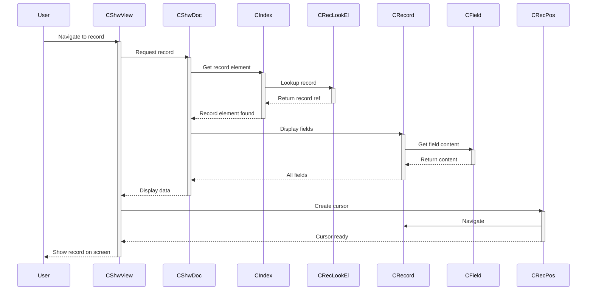

---

## 4. Core Data Model

### 4.1 Core Text Representation

| Class        | What it holds                     | Relationships                                                   | Role                                                            |
| ------------ | --------------------------------- | --------------------------------------------------------------- | --------------------------------------------------------------- |
| **Str8**     | UTF-8 string content              | Base class for all string objects                               | Raw string storage with UTF-8 support                           |
| **CMString** | String text + marker reference    | Inherits from `Str8`; references `CMarker`                      | Marked string: text tagged with metadata
| **CMarker**  | Descriptor metadata               | Referenced by `CField` (via `CMString`); member of `CMarkerSet` | Defines field type: name, language encoding, display properties |
| **CField**   | String content + marker reference | Inherits from `CMString` and `CDblListEl`; references `CMarker` | One field/data element in a record (e.g., `\dt definition`)     |

### 4.2 Field Collection Layer

| Class          | What it holds                              | Relationships                                         | Role                                                                 |
| -------------- | ------------------------------------------ | ----------------------------------------------------- | -------------------------------------------------------------------- |
| **CDblListEl** | List linkage (prev/next pointers)          | Base class for all list elements                      | Provides doubly-linked list support                                  |
| **CDblList**   | Ordered collection of `CDblListEl` objects | Generic doubly-linked list container                  | Generic list structure for any element type                          |
| **CFieldList** | Ordered list of `CField` objects           | Inherits from `CDblList`; contains `CField` objects   | Container for fields in a record                                     |
| **CRecord**    | Multiple `CField` objects with a key field | Inherits from `CFieldList`; contains `CField` objects | One complete entry/record in a database (e.g., one dictionary entry) |

### 4.3 Inheritance Graph

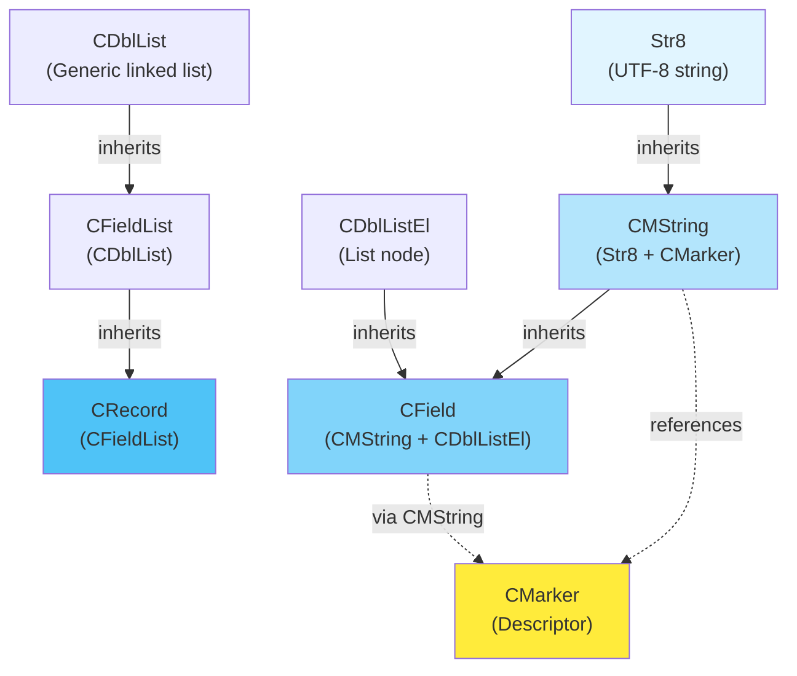

### 4.4 Data Model Example: One Record Structure

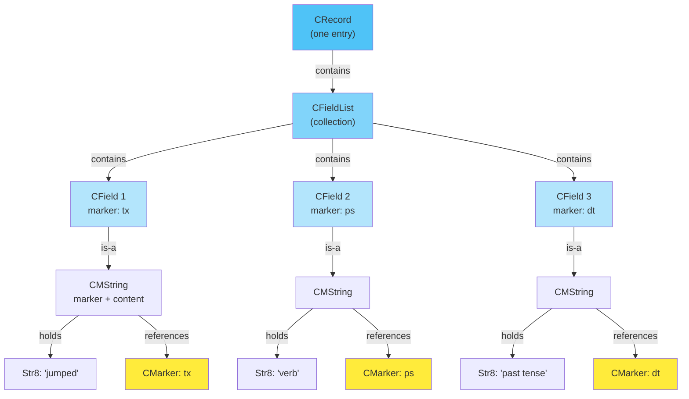

## 5. Database Structure Layer

### 5.1 Schema Definitions

| Class                | What it holds                       | Relationships                                                                                             | Role                                                                     |
| -------------------- | ----------------------------------- | --------------------------------------------------------------------------------------------------------- | ------------------------------------------------------------------------ |
| **CMarkerSet**       | All markers for one database type   | Member of `CDatabaseType`; contains `CMarker` objects                                                     | Defines all field types possible in a database                           |
| **CFilterSet**       | All filters for one database type   | Member of `CDatabaseType`                                                                                 | Search/display filters                                                   |
| **CJumpPathSet**     | Jump paths between records          | Member of `CDatabaseType`                                                                                 | Cross-reference definitions                                              |
| **CDatabaseType**    | Complete database schema + settings | Member of `CDatabaseTypeSet`; contains `CMarkerSet`, `CFilterSet`, `CJumpPathSet`, `CInterlinearProcList` | Defines structure of one type of database (e.g., "Dictionary", "Corpus") |
| **CDatabaseTypeSet** | All database type definitions       | Member of `CProject`                                                                                      | Collection of all database schemas in a project                          |

---

### 5.2 Database Relationship Graph

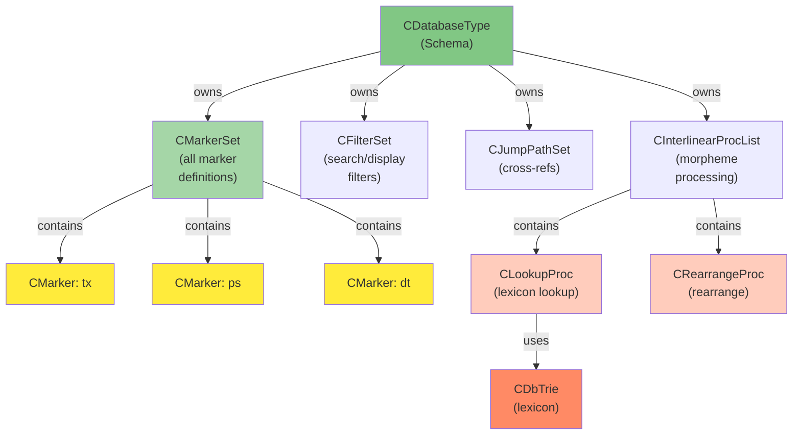

## 6. Index & Record Storage Layer

### 6.1 Indexing Logic

| Class          | What it holds                     | Relationships                                          | Role                                                                       |
| -------------- | --------------------------------- | ------------------------------------------------------ | -------------------------------------------------------------------------- |
| **CRecLookEl** | One record lookup element         | Member of `CIndex`; references `CRecord`               | Indexed record entry with sort key                                         |
| **CIndex**     | Sorted collection of `CRecLookEl` | Member of `CIndexSet`; owns sort keys and filter state | One view/index of records (same records, different sort order or filtered) |
| **CIndexSet**  | Multiple sorted `CIndex` views    | Member of `CShwDoc`                                    | All open indexes for one database document                                 |
| **CShwDoc**    | One open database file            | Contains `CIndexSet`; represents one open `.db` file   | Document/file containing all records of one database                       |

---

### 6.2 Index & Record Lookup Flow Graph

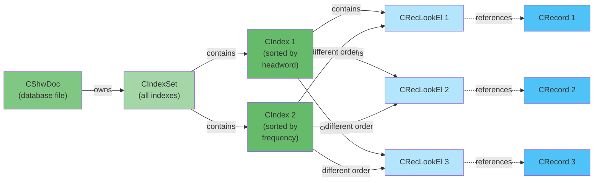

## 7. Functional Subsystems

### 7.1 Navigation & Cursor Management

| Class       | What it holds                       | Relationships                     | Role                                                     |
| ----------- | ----------------------------------- | --------------------------------- | -------------------------------------------------------- |
| **CRecPos** | Record + Field + Character position | References `CRecord` and `CField` | Cursor/caret position for navigating through record data |

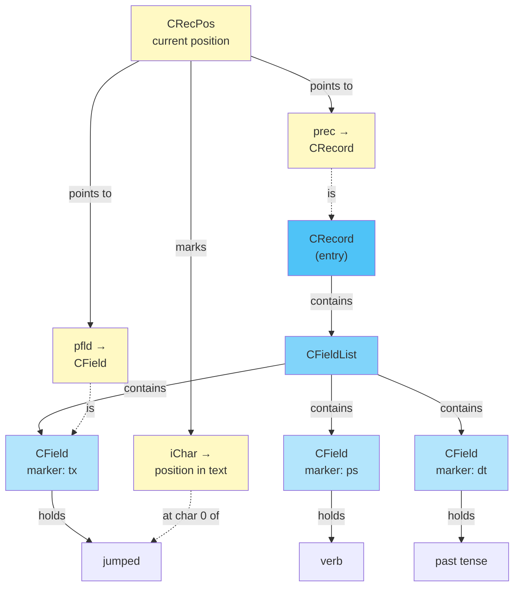

### 7.2 Interlinearization Pipeline

| Class                    | What it holds                        | Relationships                                                                              | Role                                              |
| ------------------------ | ------------------------------------ | ------------------------------------------------------------------------------------------ | ------------------------------------------------- |
| **CInterlinearProc**     | Base class for processing operations | Abstract base; owned by `CInterlinearProcList`                                             | Parent class for all interlinear processes        |
| **CLookupProc**          | Lexicon lookup and morpheme parsing  | Inherits from `CInterlinearProc`; contains `CDbTrie` (lexicon)                             | Performs morpheme lookup: breaks words into parts |
| **CRearrangeProc**       | Word rearrangement rules             | Inherits from `CInterlinearProc`                                                           | Rearranges morphemes (e.g., for adaptation)       |
| **CGivenProc**           | Mark fields as already analyzed      | Inherits from `CInterlinearProc`                                                           | Marks fields to skip processing                   |
| **CInterlinearProcList** | Ordered list of processes to run     | Inherits from `CDblList`; contains `CInterlinearProc` objects; owns `CMarkerSet` reference | Sequence of morpheme processing steps             |

---

### 7.3 Processing Graph

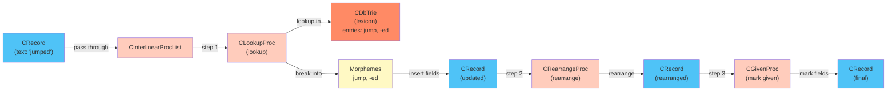

### 7.4 Workflow Diagram

User selects "jumped" record in text:

1. CShwView displays CRecord via CRecPos
2. User triggers interlinearize action
3. CLookupProc::bInterlinearize() called
4. CLookupProc looks up "jumped" in CDbTrie lexicon
5. Trie returns entries: "jump", "-ed"
6. CLookupProc creates new CField objects for morphemes
7. Inserts into CRecord's CFieldList
8. CShwView updated to show morpheme breakdown

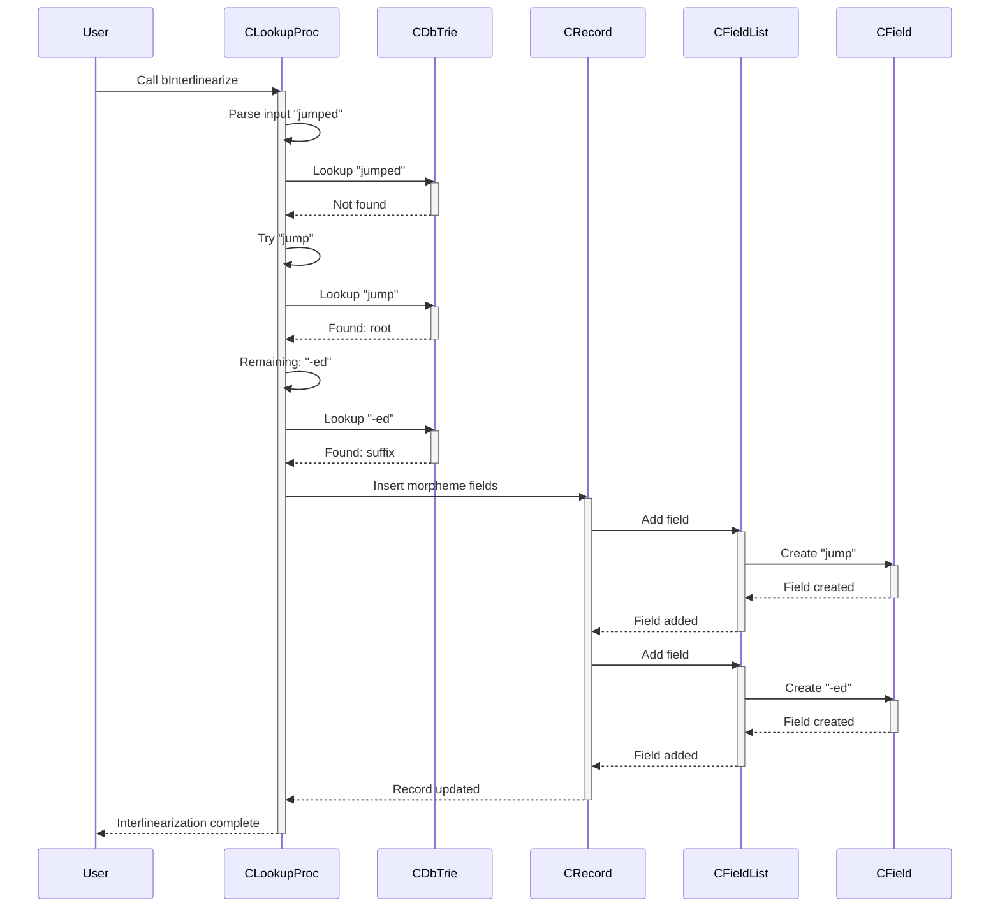

## 8. Project & Application Layer

| Class           | What it holds                | Relationships                                                                     | Role                                                                  |
| --------------- | ---------------------------- | --------------------------------------------------------------------------------- | --------------------------------------------------------------------- |
| **CCorpus**     | Text corpus for analysis     | Member of `CCorpusSet`                                                            | Collection of texts for linguistic analysis                           |
| **CCorpusSet**  | All text corpuses in project | Member of `CProject`                                                              | Manages available text resources                                      |
| **CLangEncSet** | All language encodings       | Member of `CProject`                                                              | Defines all writing systems/languages in project                      |
| **CProject**    | Complete project settings    | Contains `CDatabaseTypeSet`, `CLangEncSet`, `CCorpusSet`; referenced by `CShwDoc` | Configuration for entire project (all databases, languages, settings) |
| **CShwApp**     | Global application state     | Global singleton; contains `CProject`; owns main window                           | MFC application class; manages project and UI                         |
| **CMainFrame**  | Main window UI               | Referenced by `CShwApp`; contains views                                           | Main MDI frame window                                                 |
| **CShwView**    | Display one `CIndex`         | References `CShwDoc` and displays records                                         | View/window showing one index of records                              |

---

## 9. Files and Dependencies

### 9.1 Core Modules

| Module            | Primary Classes                     | Purpose                                        |
| ----------------- | ----------------------------------- | ---------------------------------------------- |
| **str8.cpp/h**    | `Str8`                              | UTF-8 string implementation                    |
| **mkr.cpp/h**     | `CMString`, `CMarker`, `CMarkerSet` | Marked strings and marker definitions          |
| **cfield.cpp/h**  | `CField`, `CFieldList`              | Field storage and collections                  |
| **crecord.cpp/h** | `CRecord`                           | Record storage and layout                      |
| **crecpos.cpp/h** | `CRecPos`                           | Navigation cursor                              |
| **lng.cpp/h**     | `CLangEnc`, `CLangEncSet`           | Language encoding (writing system) definitions |

### 9.2 Database & Index Modules

| Module        | Primary Classes                     | Purpose                     |
| ------------- | ----------------------------------- | --------------------------- |
| **typ.cpp/h** | `CDatabaseType`, `CDatabaseTypeSet` | Database schema definitions |
| **ind.cpp/h** | `CIndex`, `CIndexSet`, `CRecLookEl` | Record sorting and indexing |
| **fil.cpp/h** | `CFilter`, `CFilterSet`             | Search/display filters      |

### 9.3 Interlinearization Modules

| Module             | Primary Classes                                                             | Purpose                                     |
| ------------------ | --------------------------------------------------------------------------- | ------------------------------------------- |
| **interlin.cpp/h** | `CInterlinearProc`, `CLookupProc`, `CRearrangeProc`, `CInterlinearProcList` | Morpheme parsing and interlinear processing |
| **trie.cpp/h**     | `CDbTrie`, `CTrieOut`                                                       | Lexicon storage (trie data structure)       |

### 9.4 Project & Application Modules

| Module            | Primary Classes         | Purpose                                |
| ----------------- | ----------------------- | -------------------------------------- |
| **project.cpp/h** | `CProject`              | Project configuration and settings     |
| **corpus.cpp/h**  | `CCorpus`, `CCorpusSet` | Text corpora management                |
| **shw.cpp/h**     | `CShwApp`               | MFC application class and global state |
| **shwdoc.cpp/h**  | `CShwDoc`               | MFC document class (one open database) |
| **shwview.cpp/h** | `CShwView`              | MFC view class (UI window)             |
| **mainfrm.cpp/h** | `CMainFrame`            | MFC main frame window                  |

### 9.5 Utility Modules

| Module             | Primary Classes                    | Purpose                    |
| ------------------ | ---------------------------------- | -------------------------- |
| **cdbllist.cpp/h** | `CDblList`, `CDblListEl`           | Generic doubly-linked list |
| **obstream.cpp/h** | `Object_istream`, `Object_ostream` | Object serialization       |
| **update.cpp/h**   | `CUpdate` and subclasses           | Update notification system |

---

### 9.6 Compilation Dependency

1. str8.h      → (independent - core string)
2. mkr.h       → str8, set, lng
3. cfield.h    → mkr, cdbllist
4. crecord.h   → cfield, crecpos
5. crecpos.h   → crecord (circular with crecord.h)
6. ind.h       → crecord, fil, ptr
7. typ.h       → mkr, fil, interlin, ind
8. project.h   → typ, corpus, lng
9. shwdoc.h    → project, crecord, ind
10. shw.h       → project, shwdoc
11. shwview.h   → shwdoc, crecpos

#### 9.7 Compilation Graph

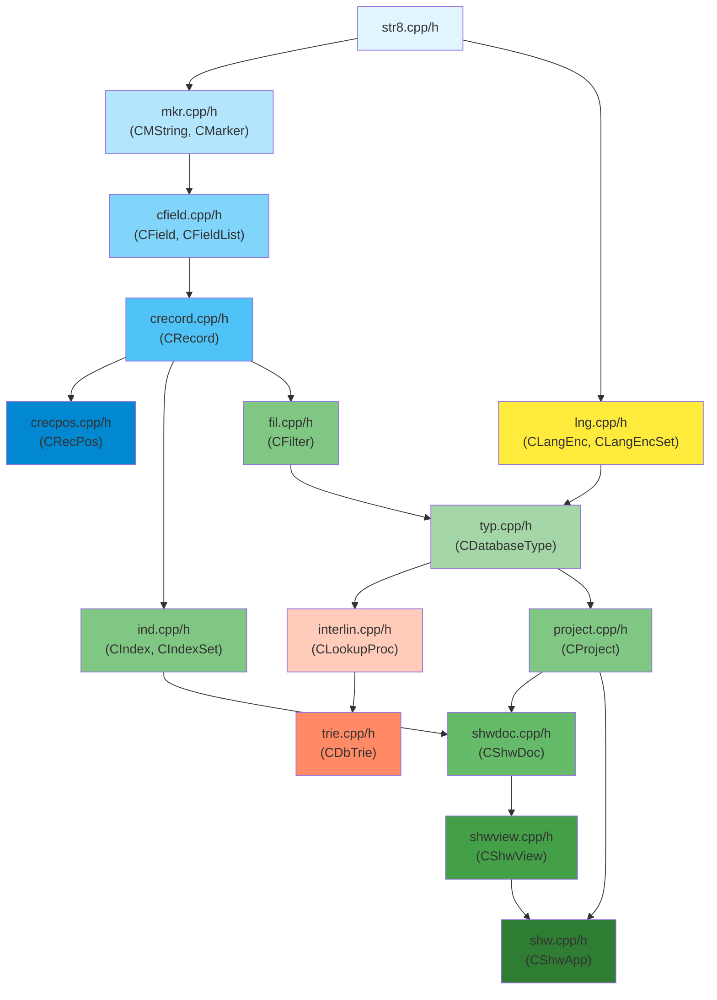

#### 9.8 Utility includes

- toolbox.h   → shw, lng, mkr (umbrella include for most sources)
- obstream.h  → independent (serialization)
- cdbllist.h  → independent (generic list)
- update.h    → mkr, typ, fil, ind (notification system)

